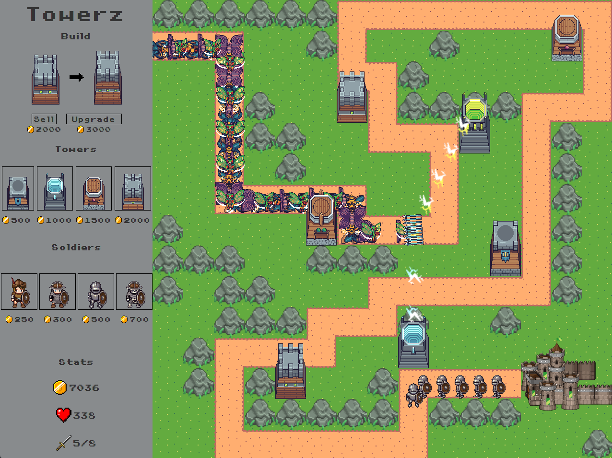

## Towerz
Simple tower defence game where player's objective is to survive consecutive waves of enemies.
This project is a challenge to build something from basic Java AWT components.
No third party packages are used (beside lombok or testing dependencies).

### How to run
Please make sure you have JDK 17 installed. 
Then run the game from IDE or use one of the scripts: `towerz.bat` `towerz.sh`

### Gameplay

### Possible improvements
- [ ] Main menu with map selection
- [ ] Persisting and viewing previous high scores
- [ ] Special tower projectile effects

### Issues
* Random infrequent fps drops
* Invalid window size when run with WSLg
* Poor tower aiming when soldiers clash with creatures
* Weak gameplay difficulty balance
